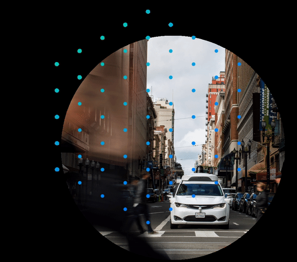
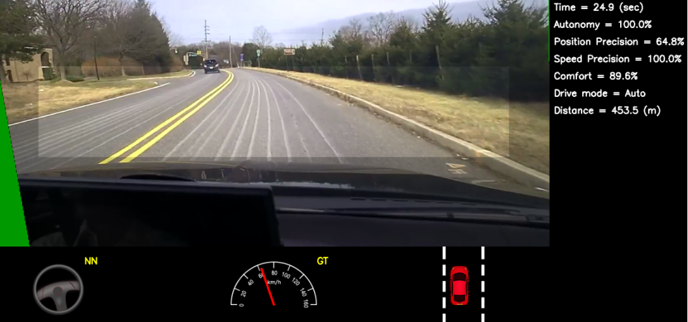

# Waymo Driverless Car Data Analysis and Driving Modeling: Team 4

This repository contains files related to the waymo project for fall 2019 semester.

## Getting Started

These instructions will cover build and usage information of the service. 

### Prerequisities

* [Waymo - Dataset](https://waymo.com/open/data/)
* [GCP](https://cloud.google.com/)
* [Linux](https://docs.docker.com/linux/started/)

## Work

### Motivation for our approach

We are trying to implement something similar to the 'End to End Learning for Self-Driving Cars' [paper](https://arxiv.org/pdf/1604.07316.pdf) by NVIDIA. 

## Versioning

For the versions available, see the 
[tags on this repository](https://github.com/sharon-waymo-project/team-4). 

## Authors

* Aashish Kumar Misraa (akm2215)
* Naman Jain (nj2387)
* Saurav Dhakad (ssd2158)

## Credits

* Prof. Sharon Di
* Rongye Shi
